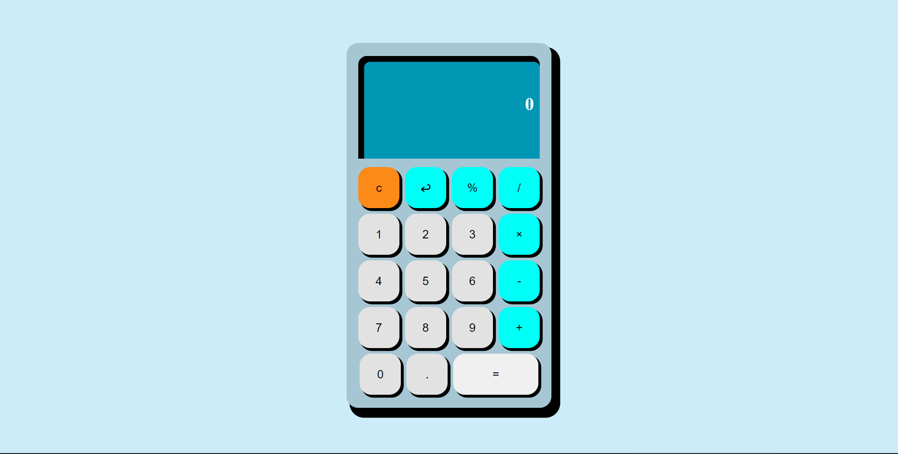

# Calculator App

A fully functional calculator built with vanilla JavaScript. This project represents the culmination of [The Odin Project](https://www.theodinproject.com) Foundations.

  

## 🚀 Live Demo
[Try the Calculator Here](https://codamee.github.io/calculator-app/)

## 🎨 Key Features
* **Sequential Operations:** Ability to string together multiple operations (e.g., `12 + 7 - 1`) with immediate evaluation of the previous pair.
* **Precision Control:** Implemented rounding logic to prevent long decimals from overflowing the display.
* **Display Logic:** Dynamic screen updates that manage string length and clear/delete functionality.

## 🛠️ Technical Skills
* **Avoidance of eval():** Built a custom math engine from scratch to safely evaluate expressions without using insecure JavaScript methods.
* **State Management:** Handled multiple variables to track the "First Number," "Operator," and "Second Number" throughout the calculation lifecycle.
* **DOM Manipulation:** Efficiently updated display elements using JavaScript string manipulation and real-time variable tracking.
* **CSS Layout:** Used Flexbox/Grid to create a responsive and clean user interface.

---
*Built as part of The Odin Project Foundations.*
